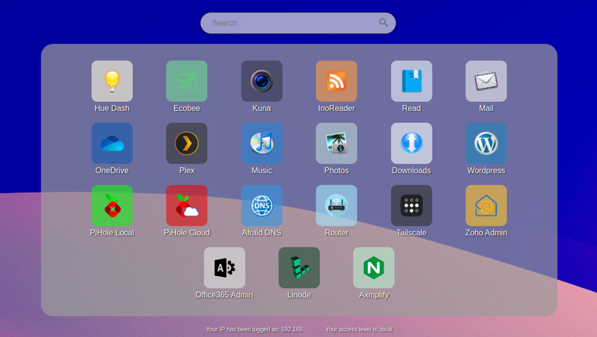

# No Place Like Home

No Place Like Home is a simple, configurable web-app launcher for your web server. Its designed to gracefully fallback to support older browsers, so some of the smarts are in PHP or behind feature detection. Its also responsive, for big or small screens, and supports light and dark mode in modern browsers. 

You provide the icons and wallpaper, so if working on old devices matters to you, make sure you scale and dither appropriately (eg: gif, not png)

The included icons are just examples (and no rights to them are implied by the license in this repo). You can provide your own, at whatever path (relative or absolute) you want, via the config file. Rename the example file `config-example.php` to `config.php` and edit/add/remove as you see fit.

## Config File Notes

### Site Identity

- `$useTitle` is the value shown in the title bar (populates the `<title>` tag)
- `$useDomain` helps to determine access level, specify the domain or hostname you will most commonly access the site with.
- `$cacheBust` if true, a unique id will be added to the query string of the style, to force browsers to reload the stylesheet with each load (which may add to load times)

### Search Prefix

The search prefix allows you to determine which search engine will be sent queries from the search bar. I've tested with Google, Bing and DuckDuckGo.

### Visitor Access Level

Access level can be used to show or hide icons, based on detected conditions. To make sure this is applied correctly for your environment, adjust the global variables as follows:

- `$localDef` an array of IP address configurations that would indicate a visitor is on the same network as the server. Adjust to match the IP settings handed out by your router. The last octet is deliberately omitted, to allow the whole subnet.
- `$vpnDef` an array of IP address configurations that would indicate a visitor is coming through a VPN or proxy. Adjust to match the IP address of the gateway. You can omit the last octet, to allow the whole subnet, or use a complete IP address to indicate a single gateway.
- All other visitors are considered remote.

### Launcher Icons

Determined by an array of objects you define. Set the Icon, Caption, destination Link, Access level, and Protocol you desire for each icon (eg: older clients might only be served http links.)

+ Icon path can be absolute or relative.
+ Caption can be any string, including HTML.
+ Destination Link can be absolute or relative.
+ Access level can be defined as a single string value: `any`, `local`, `vpn`, `remote`
    + Access level can also be multiple values defined as an array of any of those values.
+ Protocol can be: `http`, `https`, `any`

#### Swappable Icons

This is an experimental feature where option (or alt) clicking an icon can swap it, and the link with an alternate.

- Define these in the config with `altimg` and `altlink`.